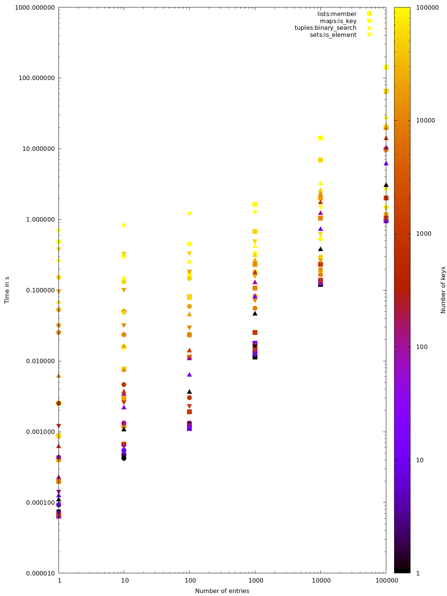

# Erlang Performance Comparison `maps:is_key` versus `lists:member`
This is a script to compare the performance of `maps:is_key` versus `lists:member` used in a filter which filters a list of elements against a list of keys. Keys and elements are both all uuid strings.


## Requirements
Based on `escript`.

To generate the plot you need
* jq
* gnuplot


## Data gathered on my machine
This is my [data.ndjson](data.ndjson) and here is a plot:



To run the performance test and generate the graph, run

```bash
make graph.png
```


Made with passion for the couch © 2020 by Johannes
