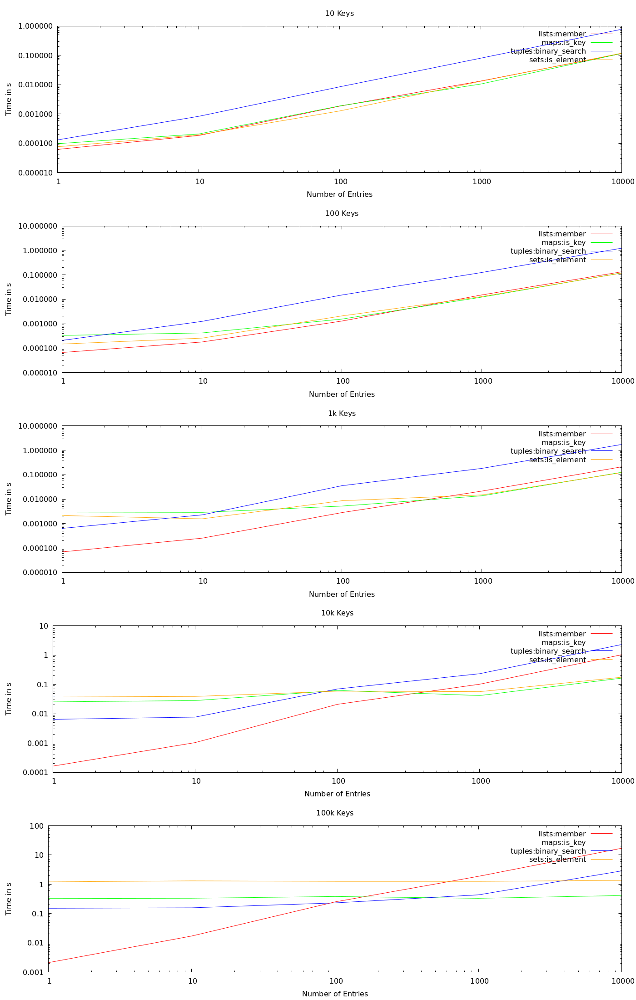
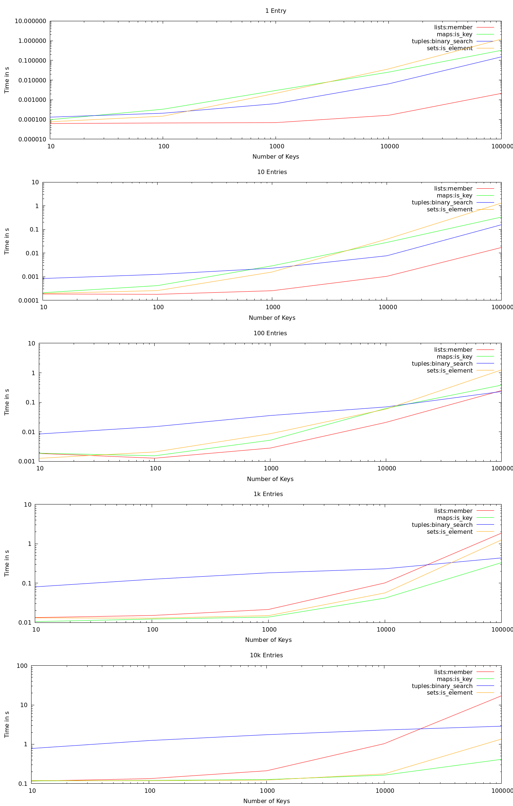

# Erlang Performance Comparison for Filtering

This is a script to compare the performance of `maps:is_key` versus `lists:member` versus a binary search against a tuple used in a filter which filters a list of elements against a list of keys. Keys and elements are both all uuid strings.


## Requirements
The [run-perf-test script](run-perf-test) is based on `escript`.

Apart from `erlang-erts` you need the following commands available in order to generate the plot:
* jq
* gnuplot


## Data
This is [data.ndjson](data.ndjson) generated on my machine and here are some plots:

### By Algorithm
These heatmaps acts a bit like a fingerprint, you can gasp the performance for a specific algorithm:


### With Fixed Keys
Look at how the different algorithms behave with certain number of keys, time per keys and algorithm:



### With Fixed Entries
The other way around, time per docs and algorithm:




## Usage
To run the performance test and generate the graph, run

```bash
make
```


Made with passion for the couch © 2020 by Johannes
